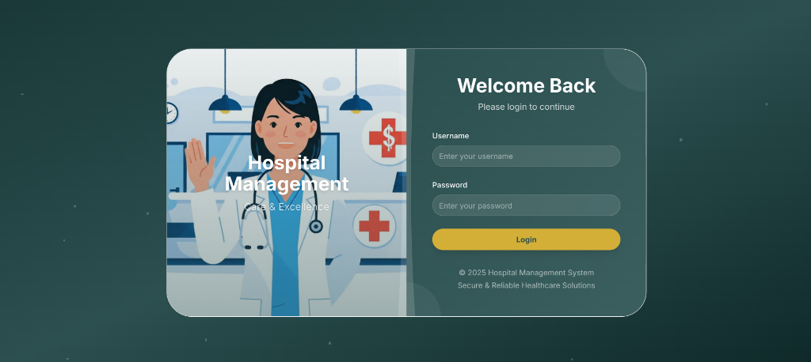
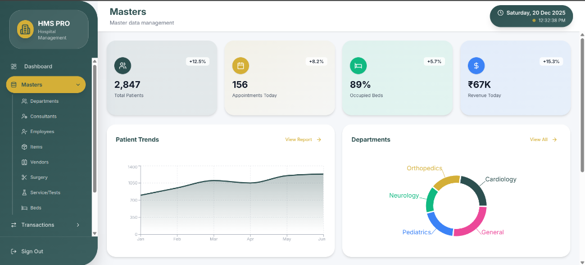

# 🏥 Hospital Management System (HMS)

A comprehensive, modern Hospital Management System built with React, TypeScript, and shadcn/ui components. This system provides a complete solution for managing hospital operations including patient registration, billing, inventory, and reporting.

## 📸 Screenshots

### Login Page



### Dashboard



## ✨ Features

### 📋 Patient Management

- **OPD Registration**: Outpatient department registration and management
- **IPD Registration**: Inpatient department registration and bed allocation
- **Patient Records**: Comprehensive patient history and medical records
- **Refer Management**: Patient referral tracking and management

### 💊 Pharmacy & Inventory

- **Purchase Entry**: Medicine and supply procurement management
- **Sales Management**: Pharmacy sales tracking
- **Stock Reports**: Real-time inventory monitoring
- **Expiry Reports**: Track and manage expiring medicines
- **Purchase Returns**: Handle return of purchased items
- **Sales Returns**: Manage customer returns

### 🔬 Laboratory & Diagnostics

- **Lab Test Management**: Configure and manage laboratory tests
- **Pathology Test Lists**: Comprehensive pathology test catalogs
- **Service Tests**: Additional diagnostic service management
- **Test Reports**: Generate and manage test results

### 🏨 Hospital Operations

- **Bed Management**: Hospital bed allocation and tracking
- **Department Management**: Organize hospital departments
- **Surgery Management**: Schedule and track surgical procedures
- **Ambulance Management**: Ambulance fleet and service tracking
- **Nursing Care**: Patient care and nursing documentation
- **Patient Care**: Comprehensive patient care tracking

### 💰 Billing & Accounts

- **IPD Accounts**: Inpatient billing and payment tracking
- **OPD Billing**: Outpatient consultation fees
- **Sales Invoicing**: Pharmacy and service billing
- **Financial Reports**: Comprehensive financial reporting

### 👥 Staff Management

- **Employee Management**: Staff records and department assignment
- **Consultant Management**: Doctor and specialist management
- **Vendor Management**: Supplier and vendor database

### 📊 Reports & Analytics

- **OPD Reports**: Outpatient department analytics
- **IPD Reports**: Inpatient department statistics
- **Purchase Reports**: Procurement tracking and analysis
- **Sales Reports**: Revenue and sales analytics
- **Stock Reports**: Inventory levels and movements
- **Lab Test Reports**: Diagnostic service reports
- **Ambulance Reports**: Ambulance service tracking

## 🚀 Technology Stack

- **Frontend Framework**: React 18 with TypeScript
- **Build Tool**: Vite
- **UI Components**: shadcn/ui (Radix UI primitives)
- **Styling**: Tailwind CSS
- **Forms**: React Hook Form with Zod validation
- **Date Handling**: date-fns
- **Icons**: Lucide React
- **Charts**: Recharts
- **Animations**: Framer Motion

## 📦 Installation

### Prerequisites

- Node.js (v16 or higher)
- npm or pnpm

### Setup Instructions

1. **Clone the repository**

   ```bash
   git clone https://github.com/Asish372/hms_software.git
   cd hms_software
   ```

2. **Navigate to the UI directory**

   ```bash
   cd hms-software-ui
   ```

3. **Install dependencies**

   ```bash
   npm install
   # or
   pnpm install
   ```

4. **Start the development server**

   ```bash
   npm run dev
   # or
   pnpm dev
   ```

5. **Open your browser**
   Navigate to `http://localhost:5173`

## 🏃 Running the Application

### Development Mode

```bash
npm run dev
```

### Build for Production

```bash
npm run build
```

### Preview Production Build

```bash
npm run preview
```

## 🎨 Project Structure

```
hms-software-ui/
├── public/                    # Static assets
├── src/
│   ├── components/           # React components
│   │   ├── dashboard-content.tsx
│   │   ├── dashboard-layout.tsx
│   │   ├── login-page.tsx
│   │   ├── forms/           # All form components
│   │   └── ui/              # shadcn/ui components
│   ├── hooks/               # Custom React hooks
│   ├── lib/                 # Utility functions
│   ├── styles/              # Global styles
│   ├── images/              # Image assets
│   ├── App.tsx              # Main app component
│   └── main.tsx             # Entry point
├── components.json          # shadcn/ui configuration
├── tsconfig.json            # TypeScript configuration
├── vite.config.ts           # Vite configuration
└── package.json             # Dependencies
```

## 👤 Default Login Credentials

**Username**: `admin`  
**Password**: `admin123`

> ⚠️ **Important**: Change these credentials in production!

## 🎯 Key Features

### Modern UI/UX

- Clean, intuitive interface with teal color theme
- Responsive design for all screen sizes
- Dark mode support via theme provider
- Smooth animations and transitions
- Premium glassmorphism effects

### Security

- Secure authentication system
- Role-based access control
- Protected routes and components

### Data Management

- Comprehensive CRUD operations
- Advanced search and filtering
- Data validation with Zod schemas
- Toast notifications for user feedback

### Reporting

- Dynamic report generation
- Date range filtering
- Export capabilities
- Visual charts and analytics

## 🔧 Configuration

### Tailwind Configuration

The project uses a custom Tailwind configuration with:

- Custom color palette (teal/cyan theme)
- Typography utilities
- Animation utilities
- Responsive breakpoints

### Component Library

This project uses shadcn/ui components which are:

- Fully customizable
- Accessible (ARIA compliant)
- Built on Radix UI primitives
- Styled with Tailwind CSS

## 📚 Available Forms

- Ambulance Form & Reports
- Bed Management
- Consultant Management
- Department Management
- Employee Management
- Expiry Reports
- IPD Accounts
- IPD Registration & Reports
- Item Management
- Lab Test Management
- Nursing Care
- OPD Registration & Reports
- Pathology Test Lists
- Patient Care
- Purchase Entry, Returns & Reports
- Refer Management & Reports
- Sales Management, Returns & Reports
- Service Test Management
- Stock Reports
- Surgery Management
- Vendor Management

## 🤝 Contributing

Contributions are welcome! Please follow these steps:

1. Fork the repository
2. Create a feature branch (`git checkout -b feature/AmazingFeature`)
3. Commit your changes (`git commit -m 'Add some AmazingFeature'`)
4. Push to the branch (`git push origin feature/AmazingFeature`)
5. Open a Pull Request

## 📝 License

This project is proprietary software. All rights reserved.

## 👨‍💻 Developer

**Asish372**

## 📧 Support

For support and queries, please create an issue in the GitHub repository.

---

Made with ❤️ for better healthcare management
